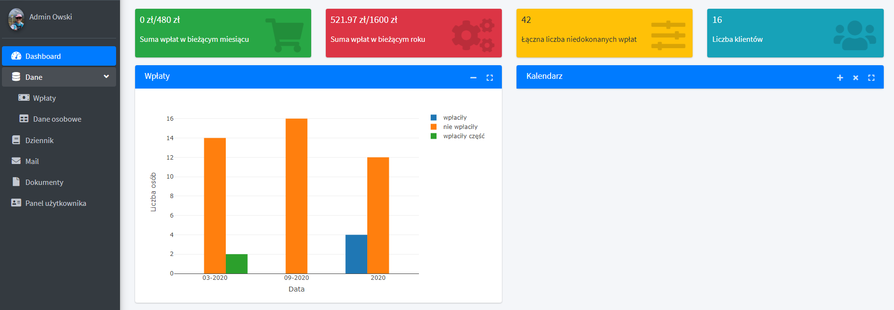
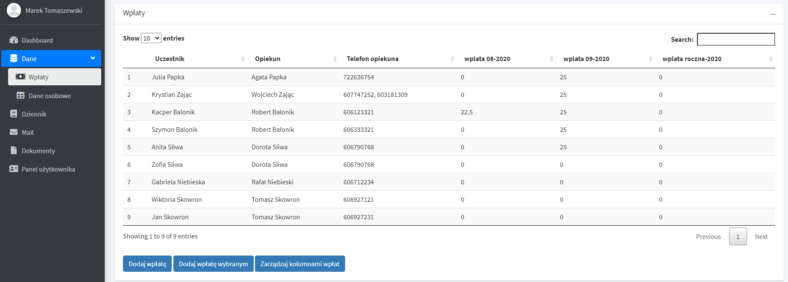

# Database

## Files

- **www directory** - you can find there profile image
- **Images directory** - you can find there images with application layout
- **global.R** - libraries and database connection
- **server.R** - back-end
- **ui.R** - front-end

## Main libraries

- **bs4Dash**, **shiny**, **shinyWidgets**, **shinymanager** - Layout and login

- **odbc**, **DBI** - Database connection

- **rdrop2**, **rJava**, **mailR** - Dropbox and mail connection

- **ggplot2**, **plotly** - Visualization

- **tidyr**, **dplyr**, **plyr**, **stringr**, **rlist** - Generally useful libraries

## Contributors

- **Mateusz Jałocha** (mat.jalocha@gmail.com, https://www.linkedin.com/in/mateusz-jałocha-8942701b6/)
